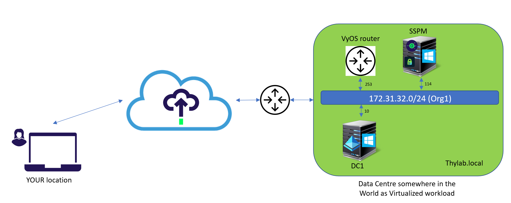
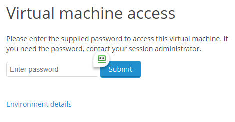
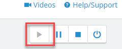
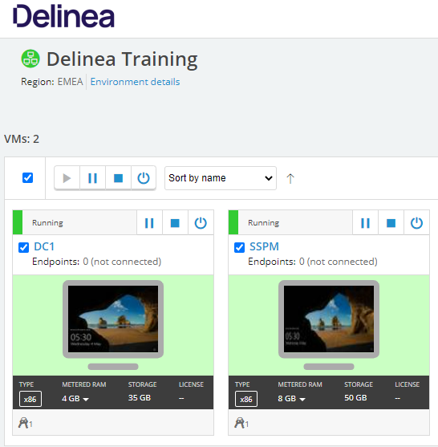

# Remote Access Solutions Lab

This lab is emulating a scenario in which an organisation (thylab.local) has wants to dismantle their VPN solution for their third party that manages an important router in their infrastructure. The organisation has found out that there is a solution based on Delinea where the connection is being made over https and no VPN software or server/appliance has to be deployed or managed.

Below is a diagram of the lab infrastructure and the entire connection including you the attendees. The Router VM is not available in the Skytap environment for you to control, but you will be able to access it after you have ran all configuration steps from outside the lab environment. Your real physical laptop.

This lab will highlight the following topics:
1. Log into a cloud tenant of Delinea solution (platform 1.0)
2. Deploying the Cloud Connector so the cloud tenant can communicate with the organisation's infrastructure 
3. Integration of the existing Secret Server installation with Platform 1.0
4. Configure Cloud Tenant for the test case
5. Test the configuration

## Checking the Skytap instance

After you have received the assignment of your lab environment, login to the provided URL. An extra password might be needed. Your training can provide you with that password so you are able to see the lan environment as shown at the beginning of the lab.

If the environment is stopped, please start it by using the "play" button in the top right corner to start the environment 

and wait till both VMs are started.

