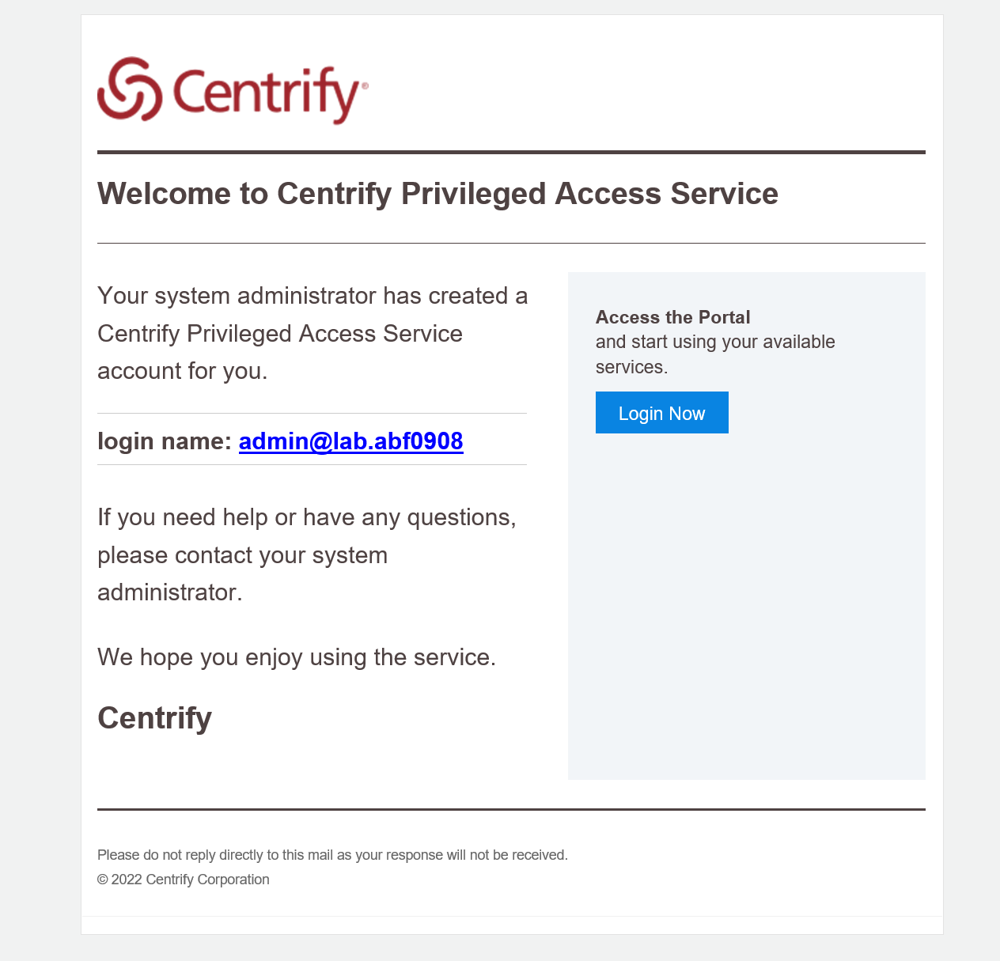
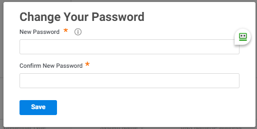
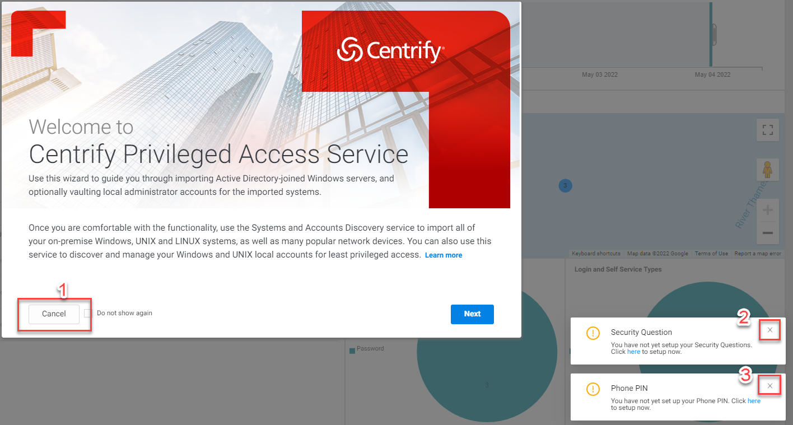

# Log into Platform 1.0

During the duration of the lab you have been granted access to use a cloud tenant. Your cloud tenant URL should have been sent to you prior to this workshop. if you don't have received your credentials, please speak to your instructor to get your tenant URL. The URL will look something like ``https://<tenant>.my.centrify.net/``
The username to use will be ``admin@lab.<tenant>``. The password will be set default to **Delinea/4u**, unless you have received the invitation email and already logged into the tenant and change the password.

The invitation email, a screenshot below as example, should be sent to you earlier. 

By clicking on the Login Now button, you will be redirected to the URl and automatically logged in. After you're logged in, you have to set a new password. This is yours to choose. Just remember it as it is your environment.

!!!Note
    We can help you if you have forgotten your password, BUT to be able to help you, please leave the **mspadmin@lab.<tenant\>** in the environment. **Do not delete it**.

1. Click on the **Cancel** button on the *Welcome to Centrify Privileged Access Service* screen and close the two popup screens that are shown in the right bottom corner.

   
   
3. As you are now able to log in, you are ready to start the next step in the lab; deploying the cloud connector into the lab environment.
