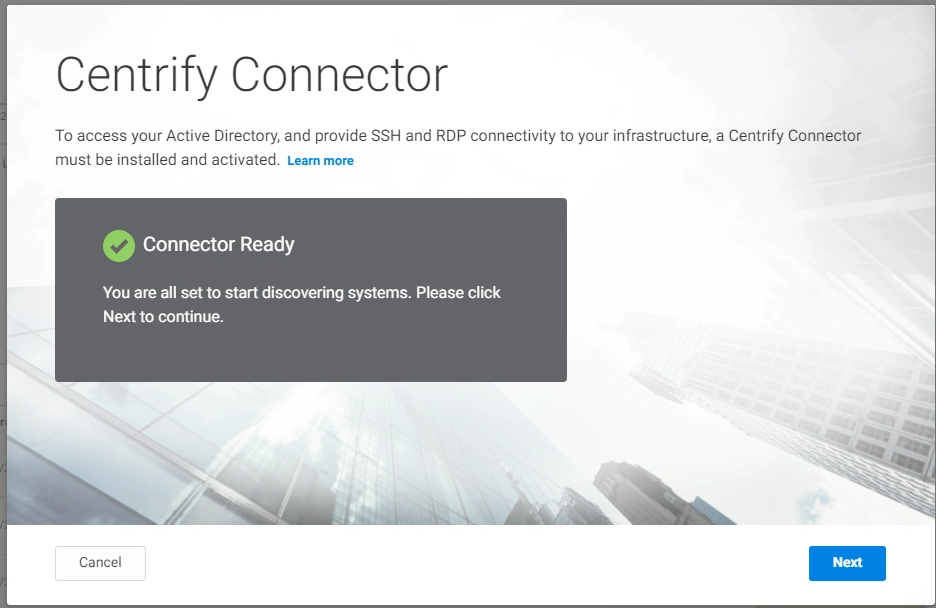
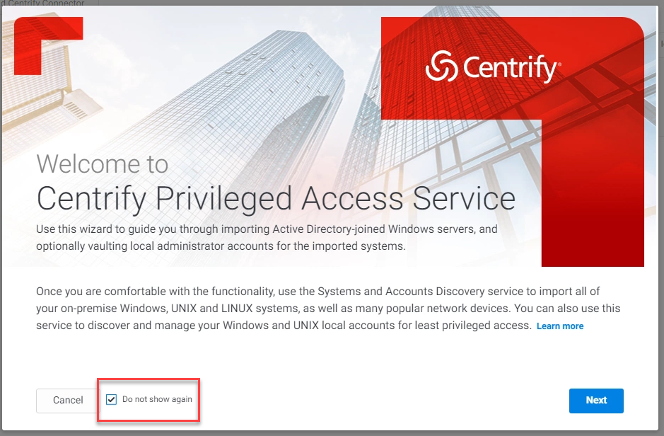

# Deploy the Cloud Connector

For this step to work, you need to connect to the virtualised Skytap environment which is running in a Data Centre in London, Singapore, or in the USA.

## Deploy the Cloud Connector

Now that the lab environment is in a running state, follow the below steps to get the Cloud Connector deployed.

1. Click on the **SSPM** desktop to open the console of the SSPM server
2. Log into the server user the following credentials:

   - **Username:** THYLAB\adm-training
   - **Password:** *Provided by the trainer*

3. Open Chrome and navigate to the URL of your cloud tenant ``https://<tenant>.my.centrify.net`` and login using the same account (**admin@lab.\<tenant\>**) using *your set password*. The same as you did before on your machine.

   

4. Click the **Next** button in the *Welcome...* Screen

   

5. Click **Centrify Connector** in *Download and Install*

   

6. Extract the downloaded Zip file and run the **Centrify-Connector-Installer-22.1.exe** to install the Connector in the extracted folder

   

7. In the *Security Warning* click **Run**

   

8. Click **Next** in the window that opened
9. Check the "I have read and accept the terms...." and click **Next**
10. In the next screen, leave everything default and click **Next**
11. Click **Install** to have the connector installed
12. In the last screen, click **Finish** to end the installation phase

## Configure the Cloud Connector

Now that the cloud connector has been installed it needs to be configured so it can "talk" to the Cloud Tenant

1. After the installation is done, a new screen opens
2. Click **Next**

   

3. Leave the checkbox checked and click **Next**

   

4. Leave all default and click **Next**
5. In the next screen provide **YOUR cloud tenant** (you can copy and paste it from the Chrome address bar). Leave the **Temporarily add...** checked

   

6. Click **Next**
7. Login as the admin@lab.\<tenant\> user in the screen that opens up
8. If the credentials were ok, a new screen will open. Leave all default (*Use Current user credentials*) and click **Next**

   

9. In the *Please select the monitored domain...*, select the **thylab.local** account and click **Next**

   

10. In the popup windows, click **Yes**

    

11. Checks will be run to make sure all is ready for the connector to connect to the Cloud Tenant

    

12. Click **Next** to proceed
13. This will Register the Connector to the Cloud Tenant and start the needed services.
14. If all went 100% you will get the below screen

    

15. Click **Finish**
16. A new screen pops up and show that the software is up to date and connected successful (status tab)

    

17. On the Connector tab, you can see where the connector is registered and if the Connector is running

    

18. Click **Close**
19. Return to the Chrome session and you should now see that a **Connector Ready** message

    

20. Click **Next**
21. In the *Discover Systems* click **Cancel**

    

    !!!Note
        The reason for canceling this step is that we will get the systems "pushed" out of the Secret Server installation. If you let the Cloud tenant discover systems, there is a change that the systems and corresponding secrets are NOT imported if the secrets have the same machine name in it. This will be solved in a new version of the RAS solution.

22. Navigate to **Settings > Network > Centrify Connector** and you will see the connector called **SSPM** mentioned

    

23. Refresh you browser. The *Welcome to...* screen will appear
24. Check the **Do not show again** 

    

25. Click **Cancel**