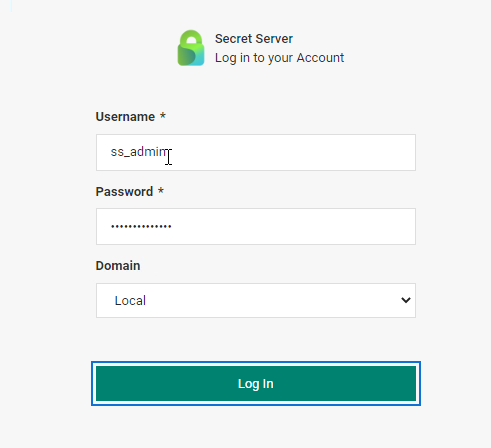
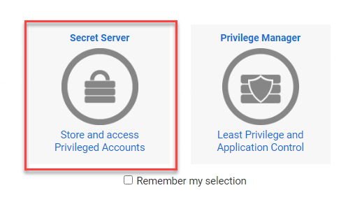
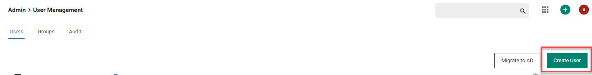
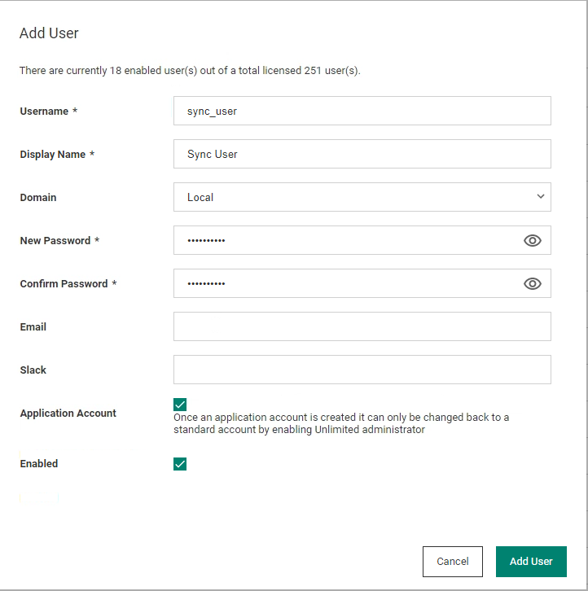
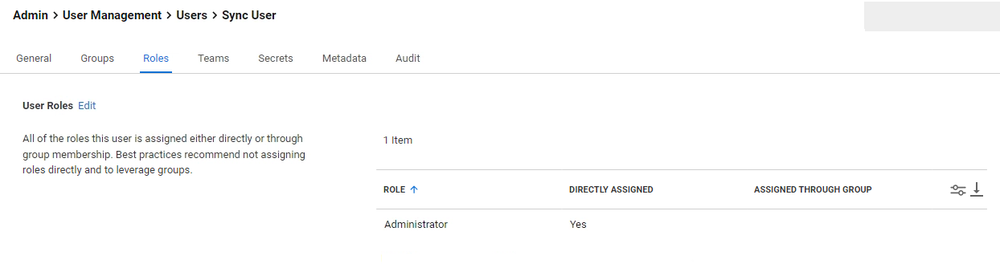
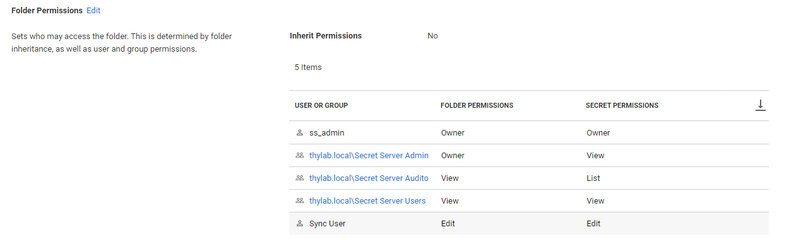

# Integrating existing Secret Server

Now that the Cloud Connector has been installed we can proceed in integrating the Secret Server that is installed in the Skytap environment

## Log into the Secret Server

1. Open the Secret Server UI by opening a new tab and navigate to <https://sspm.thlab.local/secretserver>

    !!!Note
        As this is the first time the UI is started, it will take some time as IIS needs to start the processes and load it into memory

2. Login as

    - **Username:** ss_admin
    - **Password:** *Provided by trainer*
    - **Domain:** Local
 
    

3. Click on the **Secret Server** "button"

    

4. Now all you will see all secrets that have been created

## Create a "sync" user

For the integration between the Secret Server and the Cloud tenant, we are going to setup an account that will be used to "sync" the secrets.

1. Navigate to **Admin > User Management** and click on the **Create User** button

    

2. Create a user using the following parameters:

    - **Username:** sync_user
    - **Display Name:** Sync User
    - **Domain:** Local
    - **New Password:** *Choose your own*
    - **Confirm Password:** *Choose your own*
    - **Application Account:** Checked
    - **Enabled:** Checked
 
    

3. Click **Add User**
4. Click the **sync_user** and open the *Roles* tab
5. Clik the **Edit** text next to the *User Roles* and Remove the User and add the Administrator Role to the account
6. Your configuration for the roles should look like the below screenshot

    

The steps on the Secret Server are now done and we need to switch to the Cloud tenant to integrate the Secret Server.

## Give access rights to "sync" user

To make sure the sync user can access the correct secrets, the account needs to get the correct access rights

1. In the Secret Server UI, navigate to **Secrets > Use Case Examples**
2. Right click this folder and select **Edit Folder**
3. In the section *Folder Permissions* click the **Edit** text
4. Add the created *Sync User* and provide **Editor** rights
5. Click **Save**
6. Your folder permissions should look like the below screenshot

    

    !!!Note
            Due to a setting on the show password, the account needs to have the Edit or Owner permissions to retrieve the password!

7. Navigate to **Secrets > Use Case Examples > Firewall & Networks** and repeat the steps above to add the *Sync User* with **View** rights

    !!!Note
        Using this for other secrets will then have the Sync User sync the secrets to the Cloud Tenant. Just remember that a System has to be assigned to the secret to also have a system populated in the Cloud Tenant. Otherwise the Systems can be added manually.
