# Configure Cloud Tenant

To integrate the following steps will be configured:

1. Create a new role
2. Add the Vault
3. Configure the Vault integration
4. Synchronisation of the secrets

## Create a new Role
1. Open in the browser the Tab on which your cloud tenant is active
2. Navigate to **Access > Roles**
3. Click **Add Role**
4. Name the New Role **PAS User** and provide the description: *PAS User role for Users that need some access to the cloud tenant*
5. Click on the left side of the pane, **Administrative Rights**
6. Click the **Add** button

    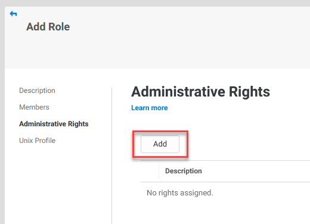

7. Check the **Privileged Access Service User**

    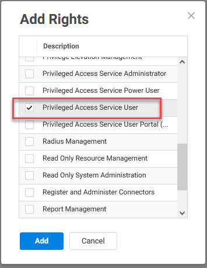

8. Click **Add**
9. Click **Save**
10. Your role should be shown in the list of roles

     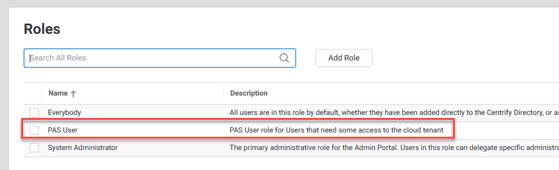

Now that we have the Role ready we can proceed to next step. Adding the Secret Server to the Cloud tenant

## Connect the Secret Server

2. Navigate to **Resources > Vaults**
3. Click **Add Vault** next to the *Search bar*
4. Fill out the fields using the following information:

    - **Name:** On Prem - Secret Server SSPM
    - **Description:** On Prem - Secret Server SSPM
    - **Vault Type:** Secret Server
    - **Vault Location:** On-premises
    - **URL:** https://sspm.thylab.local/SecretServer
    - **User name:** sync_user
    - **Password:** *The password you set during the creation of the account*
    - **Enable Sync Interval:** Unchecked for now
 
    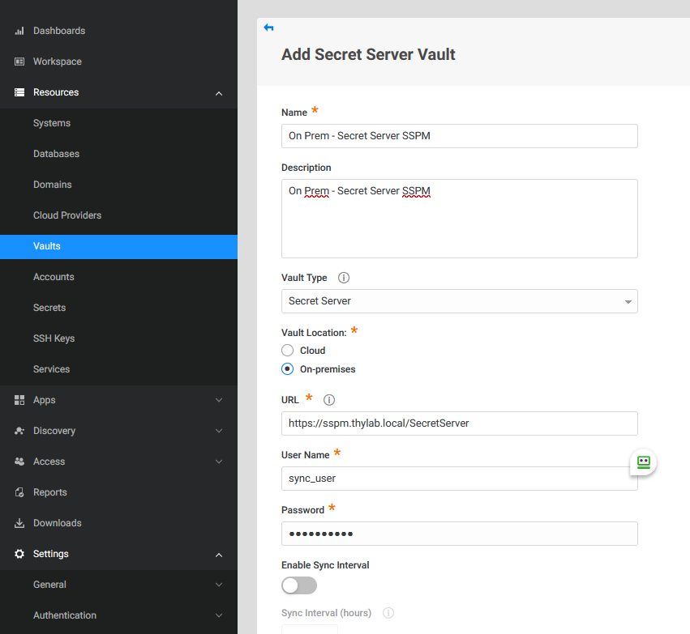

5. Click **Next**
6. In the *Add Secret Server Vault* we can only change the **Add to Sets** section (as mentioned in the Information bar, we cannot do anything else AFTER we added an on-prem Secret Server)
7. Change the *Add to Sets* to **Create Sets based on Secret Server folder hierarchy**

    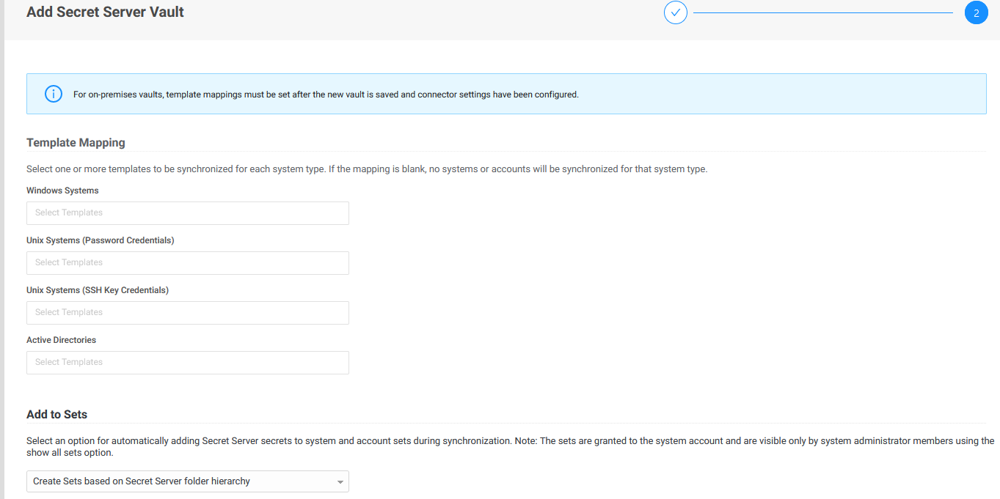

8. Click **Done**
9. Your definition will be shown

    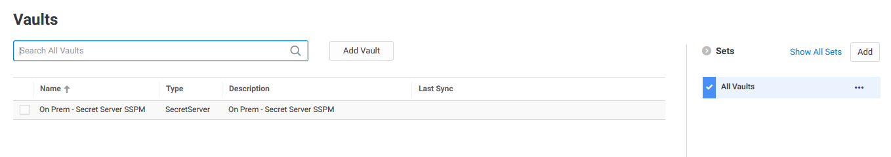

### Configure the connected vault
10. Click the definition
11. Click on the **Connectors** setting
12. Select the **Choose** and click the **checkbox** in front of the SSPM connector.

     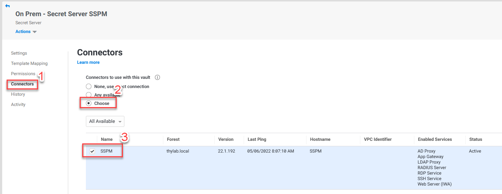

13. Click the **Permissions**
14. Click the **Add** button

     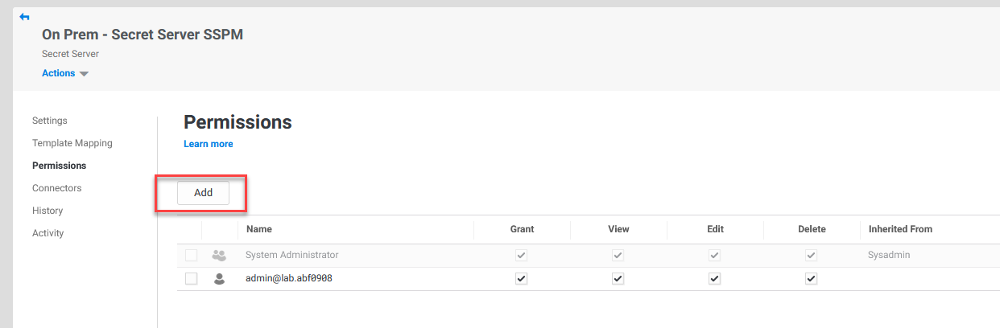

15. In the Search bar type *PAS* and select teh **PAS User**

     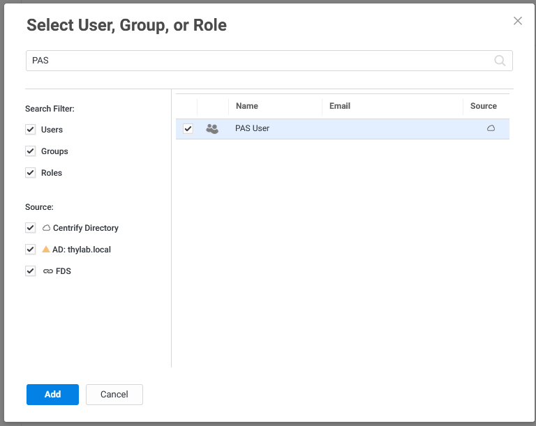

16. Click **Add**
17. Make sure the PAS User has the *View* checked (default)
18. Click the **Template Mapping**
19. Set the *Windows Systems* to include the following Templates:

     - Windows Account

20. Set the *Unix Systems (Password Credentials)* to include the following Templates:

     - Unix Account (SSH)
     - Unix Account (SSH)(Session Connector)
     - Unix Root Account (SSH)

21. Set the *Unix Systems (SSH Key Credentials)* to include the following Templates:

     - Unix Account (Privileged Account SSH Key Rotation - No Password)
     - Unix Account (Privileged Account SSH Key Rotation)
     - Unix Account (SSH Key Rotation - No Password)
     - Unix Account (SSH Key Rotation)

22. Set the *Active Directories* to include the following Templates:

     - Active Directory (Hidden Details)
     - Active Directory (Multiple Launchers)
     - Active Directory (No Heartbeat)
     - Active Directory (Restricted Launcher
     - Active Directory (Session Connector)
     - Active Directory Account

23. Your configuration should look like the below screenshot

     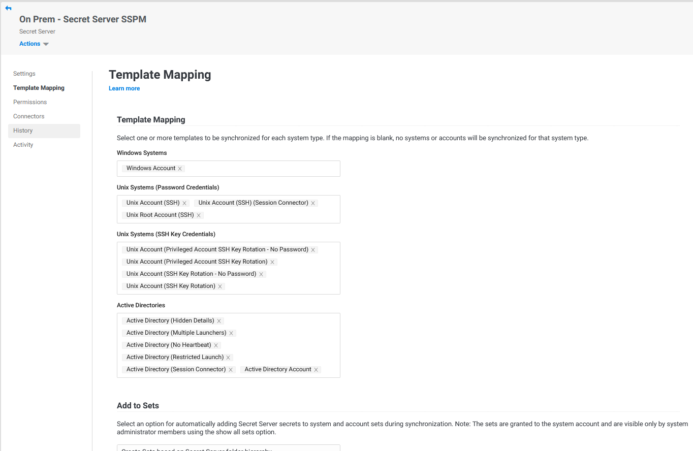

24. Click **Save**

## Synchronisation of Secrets

1. Click **Actions > Verify** to see that the connection can be made to the Secret Server. If the connection was successful, you will see this appear at the top of the screen

    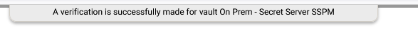

2. Click **Actions > Sync** to start the synchronisation of the secrets in Secret server

    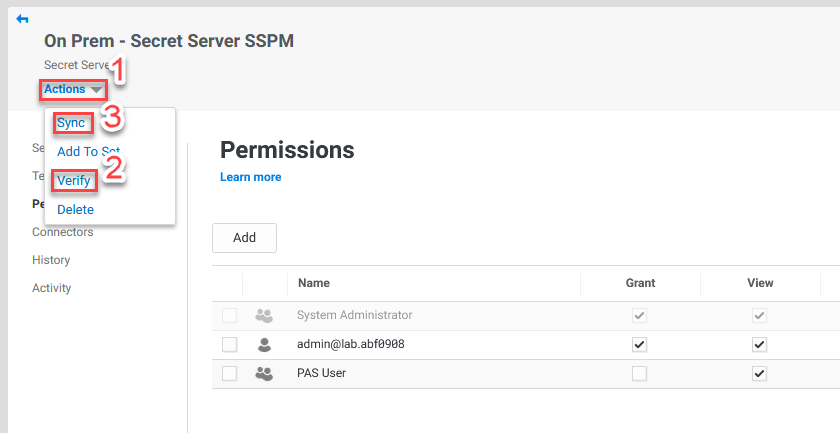

3. While still in the settings of the Vault, click on History to see that the synchronsation has taken place and that objects have been added

    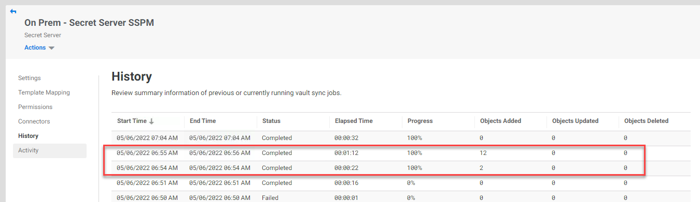

Now that we have the secrets being synchronised into the Cloud Tenant we can start to build the test environment.
