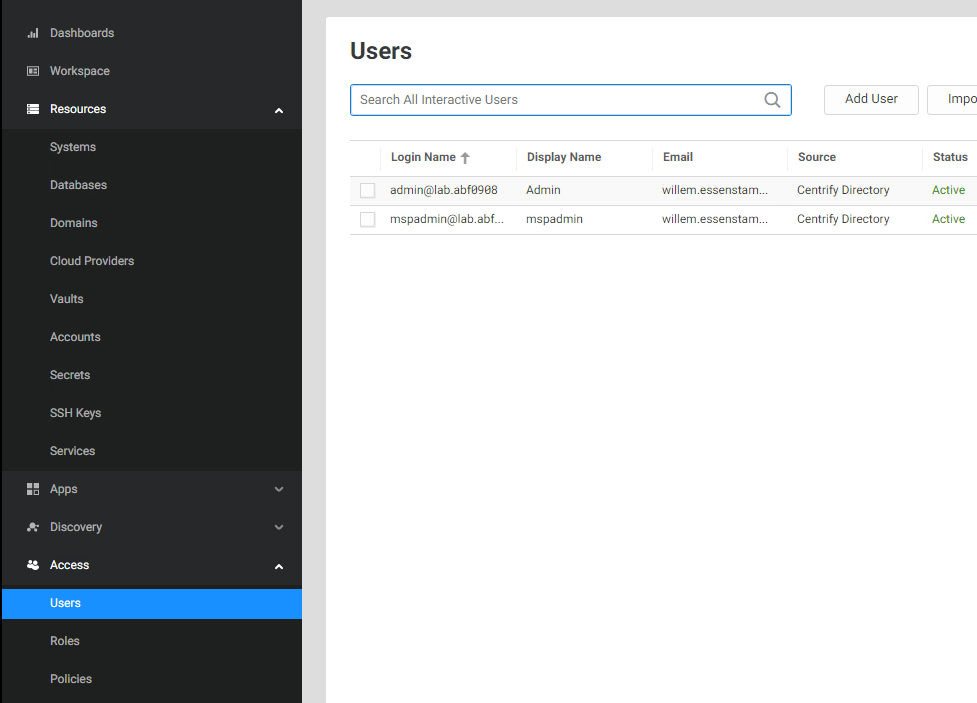
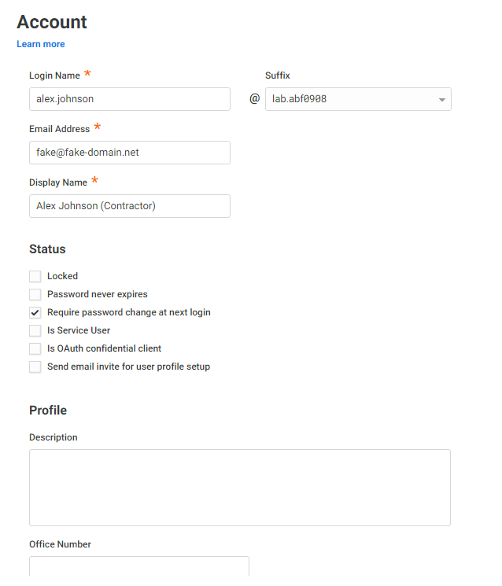
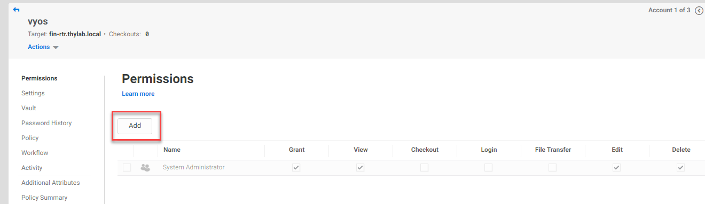
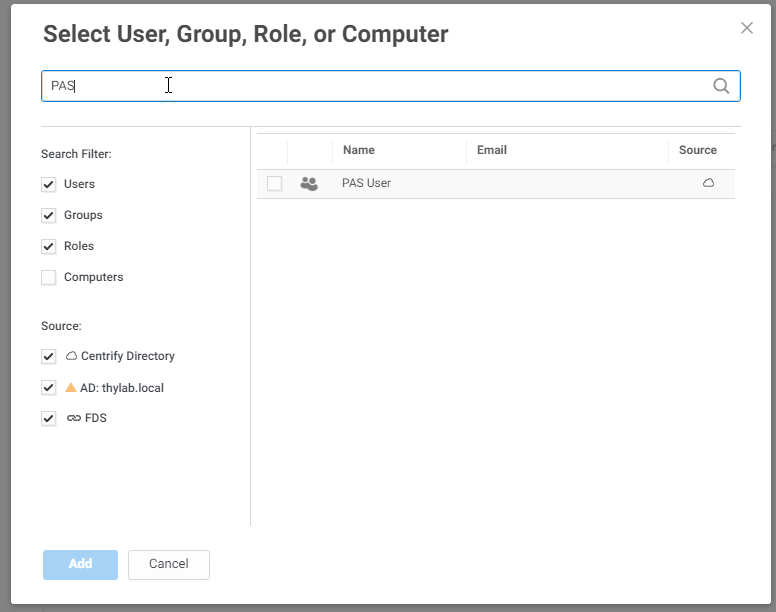
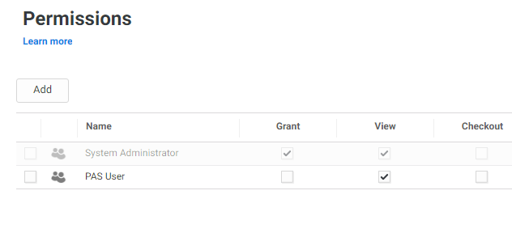
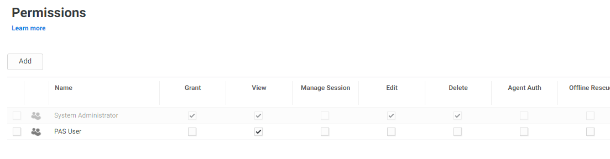
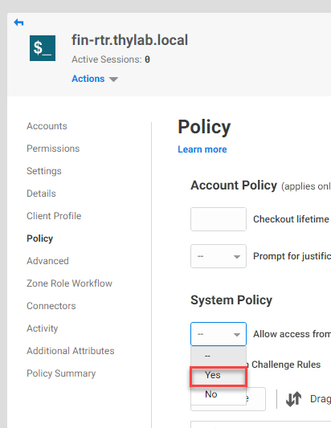
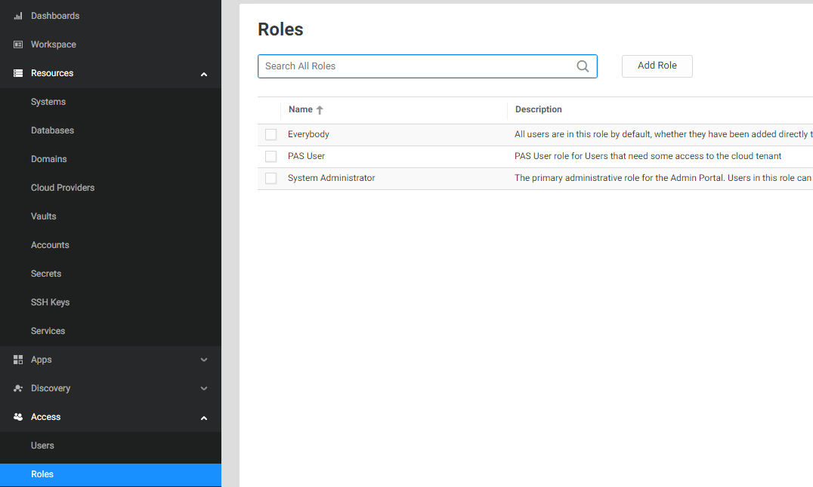
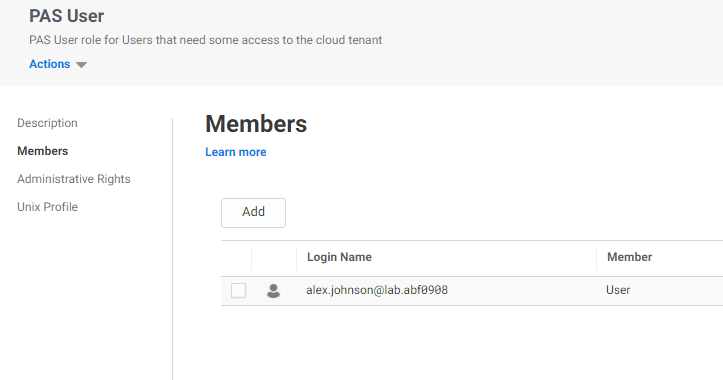

# Configure Cloud Tenant for the test case

For the test case a new account is needed which will emulate the 3rd party that needs to have a connection to the Financial router as mentioned in the introduction.
The following tasks are described in this part of the lab:
- Create an account for the contractor (Alex Johnson)
- Assign the rights for the Role PAS User
- Assign the role to Alex Johnson

## Create the Contractor account

1. Navigate in the Cloud Tenant to **Access > Users**
2. Click the **Add User** button

    

3. Provide the following information for the account:

    - **Login Name:** alex.johnson (suffix can not be changed)
    - **Email Address:** Use any email address you can access. This can be anything from corporate to personal email address
    - **Display Name:** Alex Johnson (Contractor)
    - **Manual:** *Provide your own password*
    - **Require password change at...** checked
    - **Send email invite...** unchecked
    - *Leave all other options default*
    
    

4. Click **Create User**

## Assign the rights for Role Pas User

To make sure the contractor, read role, has the correct rights, access rights need to be assigned. The assignment need to be done on four levels:

- Vault (done at integration time)
- Accounts
- Domain
- Systems

### Accounts

To assign rights the best, dynamical, way to assign rights is to make use of the *Sets*. This way new accounts (read secrets) that are being synced to the Cloud Tenant are added to the Role. As this might lead to issues in certain situations, like this scenario where contractors need access to systems, it is going to be done on account level

1. Navigate to **Resources > Accounts**
2. Click **fin-rtr.thylab.local**
3. On the *Permissions* tab (left hand side and default) click **Add**

    

4. Type **PAS** and select the *PAS User**

    

5. Click **Add**
6. Make sure the **View** and the **Login** are checked (default)

    

7. Click **Save**

### Domain

The next step is to provide access rights to the Domain so it can use and see the accounts (secrets)

1. Navigate to **Resources > Domains**
2. Click the **Thylab.local** account, not the Thylab (Unreachable). This domain is populated due to the sync with Secret Server
3. Under **Permissions** add the role **PAS User** with *View* rights using the know process

### Systems

Now that the Vault, Accounts and Domains are set up for the role the last step for the rights is to provide access to the system

1. Navigate to **Resources > Systems**
2. Click the **fin-rtr.thylab.local** system
3. Under *Permissions* add the **PAS User** and make sure the *View* column is selected

    

4. Click **Policy** in the left hand side and set the *System Policy > Allow access from a public network (web client only)* to **Yes**

    

4. Click **Save**

## Assign the role to Alex Johnson

Now that the role have all the correct rights assigned, the account Alex Johnson needs to be assigned to the role.

1. Navigate to **Access > Roles**
2. Click on the **PAS User**

    

3. Click *Members* and add alex.johnson@lab.\<tenant\> to the role

    

4. Click **Save**