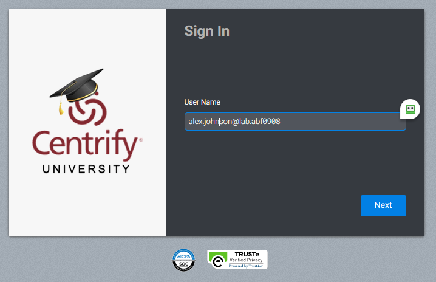
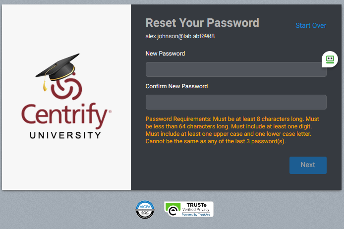
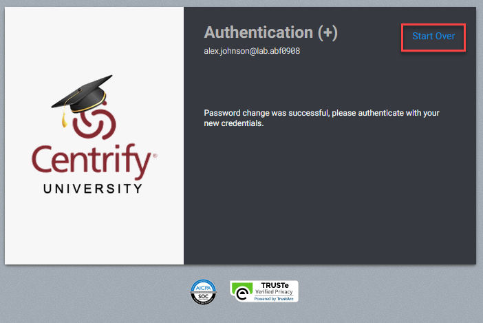
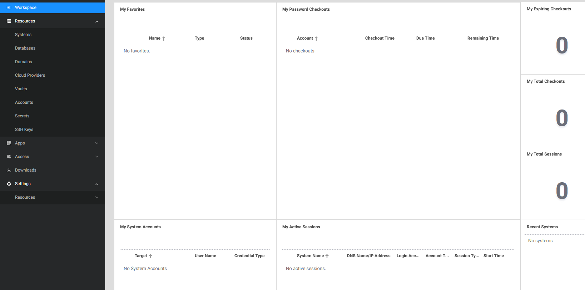
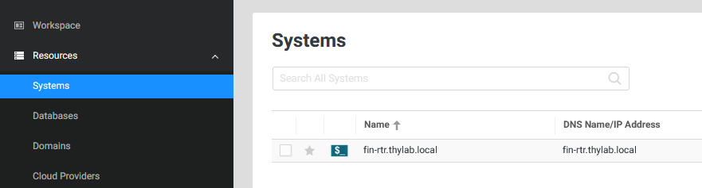
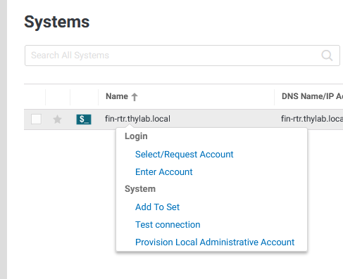
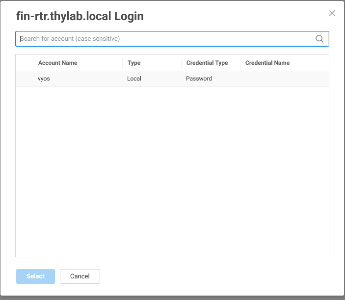
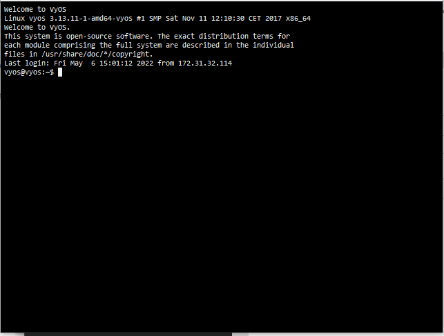
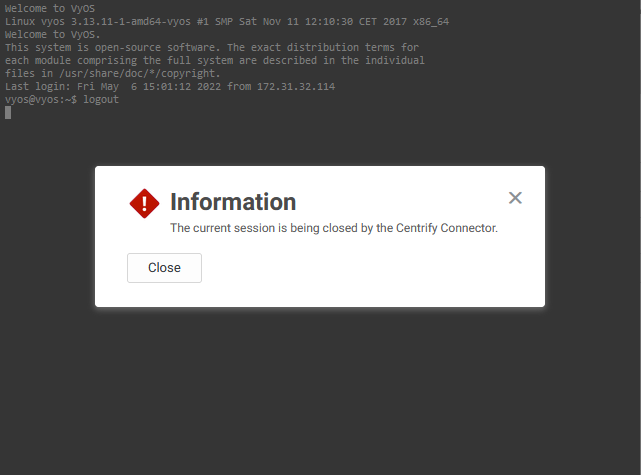

# Test the basic configuration

Now putting everything together a test is to be run to see if the scenario can be solved using the configuration and setup that have been done.

1. Using your physical machine, open a new tab and navigate to the URL of your cloud tenant ``https://<tenant>.my.centrify.net`` and login with **alex.johnson@lab.<tenant\>** using the initially set password

    

2. As the default system is set to change the password, provide the new password for the account

    

3. After you have set the new password, and it has been accepted by the system, click the **Start Over** text in the top right corner

    

4. Login using the new password and the UI should open.

    

5. Navigate to **Resources > Systems** and the *fin-rtr.thylab.local* system should be shown
    

6. Right click the system and select **Select/Request Account**

    

7. The *vyos* account should be shown

    

8. Select the *vyos* account, and click **Select** a new window will open where the connection should be made. After a few seconds the screen will show the commandline of the vyos router

    

9. Close the connection by typing *<CTRL\>+D* and click **Close** on the information screen which will close the screen

    