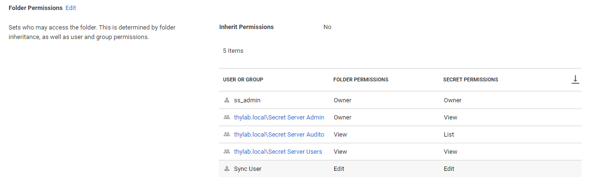
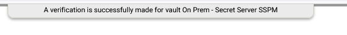
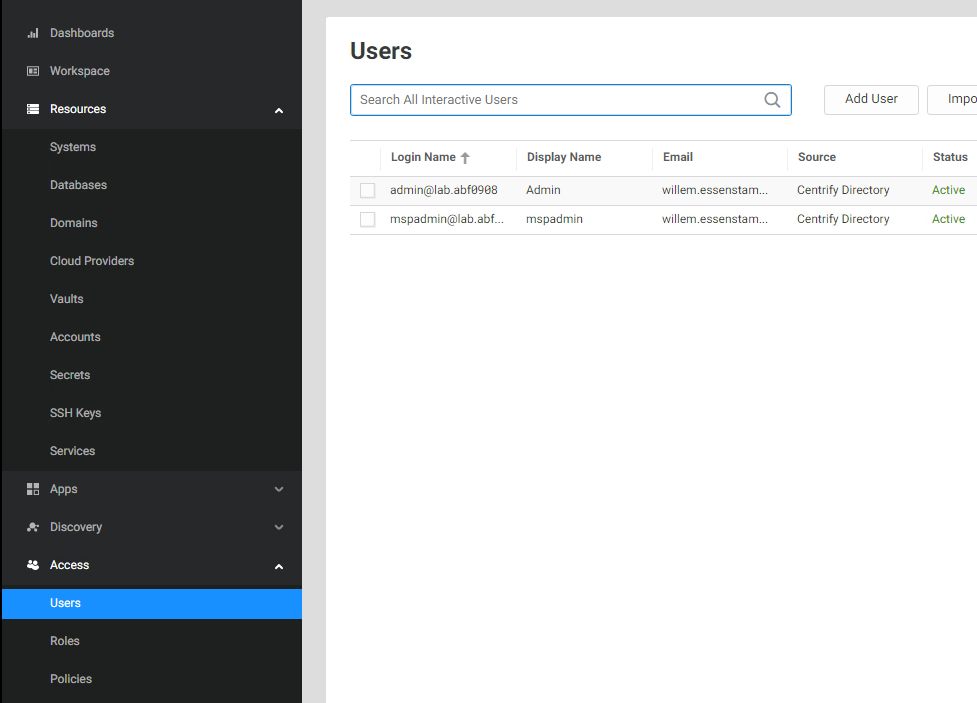
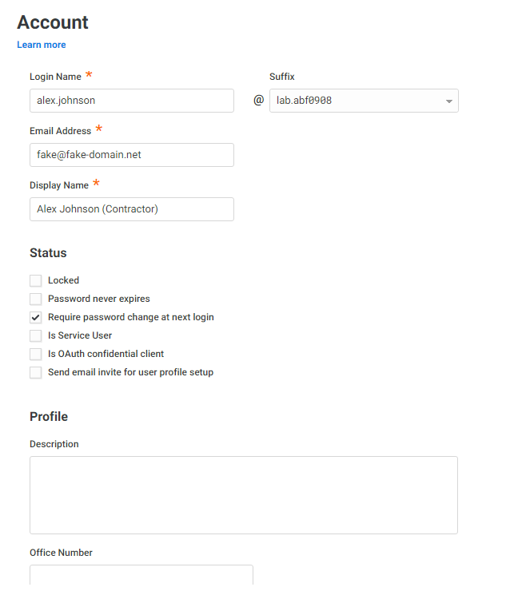
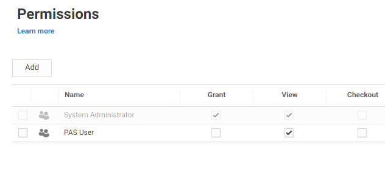
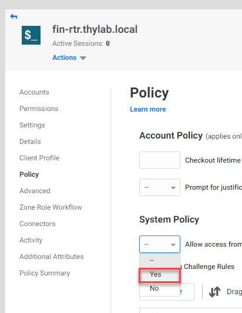
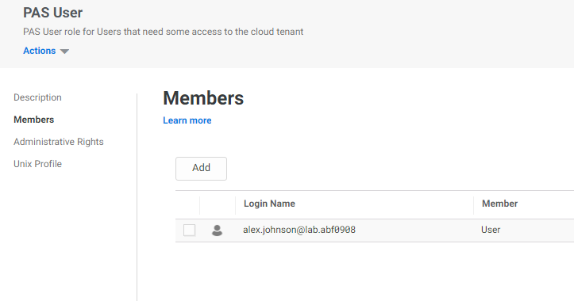
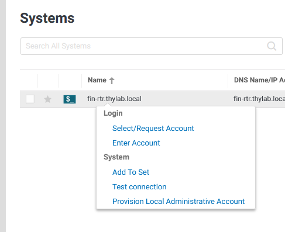
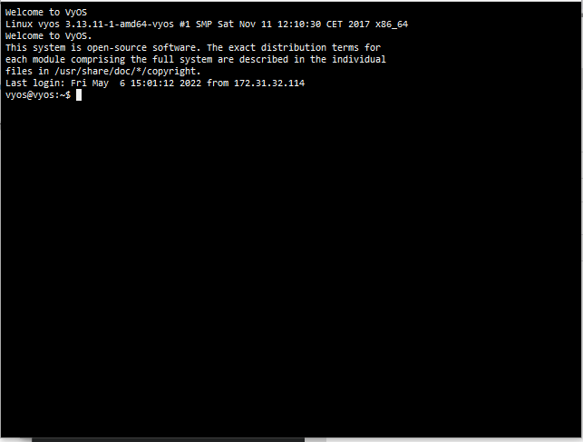
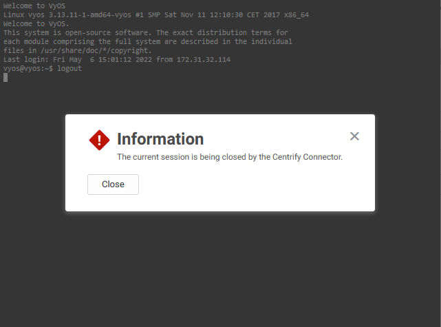

# Remote Access Solutions Lab

This lab is emulating a scenario in which an organisation (thylab.local) has wants to dismantle their VPN solution for their third party that manages an important router in their infrastructure. The organisation has found out that there is a solution based on Delinea where the connection is being made over https and no VPN software or server/appliance has to be deployed or managed.

Below is a diagram of the lab infrastructure and the entire connection including you the attendees. The Router VM is not available in the Skytap environment for you to control, but you will be able to access it after you have ran all configuration steps from outside the lab environment. Your real physical laptop.

This lab will highlight the following topics:
1. Log into a cloud tenant of Delinea solution (platform 1.0)
2. Deploying the Cloud Connector so the cloud tenant can communicate with the organisation's infrastructure 
3. Integration of the existing Secret Server installation with Platform 1.0
4. Configure Cloud Tenant for the test case
5. Test the configuration

# Log into Platform 1.0

During the duration of the lab you have been granted access to use a cloud tenant. Your cloud tenant URL should have been sent to you prior to this workshop. if you don't have received your credentials, please speak to your instructor to get your tenant URL. The URL will look something like ``https://<tenant>.my.centrify.net/``
The username to use will be ``admin@lab.<tenant>``. The password will be set default to **Delinea/4u**, unless you have received the invitation email and already logged into the tenant and change the password.

The invitation email, a screenshot below as example, should be sent to you earlier. 

By clicking on the Login Now button, you will be redirected to the URl and automatically logged in. After you're logged in, you have to set a new password. This is yours to choose. Just remember it as it is your environment.

---

**Note**

We can help you if you have forgotten your password, BUT to be able to help you, please leave the **mspadmin@lab.\<tenant\>** in the environment. **Do not delete it**.

---

1. Click on the **Cancel** button on the *Welcome to Centrify Privileged Access Service* screen and close the two popup screens that are shown in the right bottom corner.

   
   
3. As you are now able to log in, you are ready to start the next step in the lab; deploying the cloud connector into the lab environment.

# Deploy the Cloud Connector

For this step to work, you need to connect to the virtualised Skytap environment which is running in a Data Centre in London, Singapore, or in the USA.

## Checking the Skytap instance

After you have received the assignment of your lab environment, login to the provided URL. An extra password might be needed. Your training can provide you with that password so you are able to see the lan environment as shown at the beginning of the lab.

If the environment is stopped, please start it by using the "play" button in the top right corner to start the environment 

and wait till both VMs are started.

## Deploy the Cloud Connector

Now that the lab environment is in a running state, follow the below steps to get the Cloud Connector deployed.

1. Click on the **SSPM** desktop to open the console of the SSPM server
2. Log into the server user the following credentials:

   - **Username:** THYLAB\adm-training
   - **Password:** *Provided by the trainer*

3. Open Chrome and navigate to the URL of your cloud tenant ``https://<tenant>.my.centrify.net`` and login using the same account (**admin@lab.\<tenant\>**) using *your set password*. The same as you did before on your machine.

   

4. Click the **Next** button in the *Welcome...* Screen

   

5. Click **Centrify Connector** in *Download and Install*

   

6. Extract the downloaded Zip file and run the **Centrify-Connector-Installer-22.1.exe** to install the Connector in the extracted folder

   

7. In the *Security Warning* click **Run**

   

8. Click **Next** in the window that opened
9. Check the "I have read and accept the terms...." and click **Next**
10. In the next screen, leave everything default and click **Next**
11. Click **Install** to have the connector installed
12. In the last screen, click **Finish** to end the installation phase

## Configure the Cloud Connector

Now that the cloud connector has been installed it needs to be configured so it can "talk" to the Cloud Tenant

1. After the installation is done, a new screen opens
2. Click **Next**

   

3. Leave the checkbox checked and click **Next**

   

4. Leave all default and click **Next**
5. In the next screen provide **YOUR cloud tenant** (you can copy and paste it from the Chrome address bar). Leave the **Temporarily add...** checked

   

6. Click **Next**
7. Login as the admin@lab.\<tenant\> user in the screen that opens up
8. If the credentials were ok, a new screen will open. Leave all default (*Use Current user credentials*) and click **Next**

   

9. In the *Please select the monitored domain...*, select the **thylab.local** account and click **Next**

   

10. In the popup windows, click **Yes**

    

11. Checks will be run to make sure all is ready for the connector to connect to the Cloud Tenant

    

12. Click **Next** to proceed
13. This will Register the Connector to the Cloud Tenant and start the needed services.
14. If all went 100% you will get the below screen

    

15. Click **Finish**
16. A new screen pops up and show that the software is up to date and connected successful (status tab)

    

17. On the Connector tab, you can see where the connector is registered and if the Connector is running

    

18. Click **Close**
19. Return to the Chrome session and you should now see that a **Connector Ready** message

    

20. Click **Next**
21. In the *Discover Systems* click **Cancel**

    

---

**Note**

The reason for canceling this step is that we will get the systems "pushed" out of the Secret Server installation. If you let the Cloud tenant discover systems, there is a change that the systems and corresponding secrets are NOT imported if the secrets have the same machine name in it. This will be solved in a new version of the RAS solution.

---

22. Navigate to **Settings > Network > Centrify Connector** and you will see the connector called **SSPM** mentioned

    

23. Refresh you browser. The *Welcome to...* screen will appear
24. Check the **Do not show again** 

    

25. Click **Cancel**

# Integrating existing Secret Server

Now that the Cloud Connector has been installed we can proceed in integrating the Secret Server that is installed in the Skytap environment

## Log into the Secret Server

1. Open the Secret Server UI by opening a new tab and navigate to https://sspm.thlab.local/secretserver 

   ---

   **Note**
   
   As this is the first time the UI is started, it will take some time as IIS needs to start the processes and load it into memory

   ---

2. Login as

   - **Username:** ss_admin
   - **Password:** *Provided by trainer*
   - **Domain:** Local

   

3. Click on the **Secret Server** "button"

   

4. Now all you will see all secrets that have been created

## Create a "sync" user

For the integration between the Secret Server and the Cloud tenant, we are going to setup an account that will be used to "sync" the secrets.

1. Navigate to **Admin > User Management** and click on the **Create User** button

   

2. Create a user using the following parameters:

   - **Username:** sync_user
   - **Display Name:** Sync User
   - **Domain:** Local
   - **New Password:** *Choose your own*
   - **Confirm Password:** *Choose your own*
   - **Application Account:** Checked
   - **Enabled:** Checked

   

3. Click **Add User**
4. Click the **sync_user** and open the *Roles* tab
5. Clik the **Edit** text next to the *User Roles* and Remove the User and add the Administrator Role to the account
6. Your configuration for the roles should look like the below screenshot

   

The steps on the Secret Server are now done and we need to switch to the Cloud tenant to integrate the Secret Server.

## Give access rights to "sync" user

To make sure the sync user can access the correct secrets, the account needs to get the correct access rights

1. In the Secret Server UI, navigate to **Secrets > Use Case Examples**
2. Right click this folder and select **Edit Folder**
3. In the section *Folder Permissions* click the **Edit** text
4. Add the created *Sync User* and provide **Editor** rights
5. Click **Save**
6. Your folder permissions should look like the below screenshot

   

   ---

   **Note**

   Due to a setting on the show password, the account needs to have the Edit or Owner permissions to retrieve the password!

   ---

7. Navigate to **Secrets > Use Case Examples > Firewall & Networks** and repeat the steps above to add the *Sync User* with **View** rights

---

**Note**

Using this for other secrets will then have the Sync User sync the secrets to the Cloud Tenant. Just remember that a System has to be assigned to the secret to also have a system populated in the Cloud Tenant. Otherwise the Systems can be added manually.

---

## Configure Cloud Tenant

To integrate the following steps will be configured:

1. Create a new role
2. Add the Vault
3. Configure the Vault integration
4. Synchronisation of the secrets

### Create a new Role
1. Open in the browser the Tab on which your cloud tenant is active
2. Navigate to **Access > Roles**
3. Click **Add Role**
4. Name the New Role **PAS User** and provide the description: *PAS User role for Users that need some access to the cloud tenant*
5. Click on the left side of the pane, **Administrative Rights**
6. Click the **Add** button

   

7. Check the **Privileged Access Service User**

   

8. Click **Add**
9. Click **Save**
10. Your role should be shown in the list of roles

    

Now that we have the Role ready we can proceed to next step. Adding the Secret Server to the Cloud tenant

### Connect the Secret Server

2. Navigate to **Resources > Vaults**
3. Click **Add Vault** next to the *Search bar*
4. Fill out the fields using the following information:

   - **Name:** On Prem - Secret Server SSPM
   - **Description:** On Prem - Secret Server SSPM
   - **Vault Type:** Secret Server
   - **Vault Location:** On-premises
   - **URL:** https://sspm.thylab.local/SecretServer
   - **User name:** sync_user
   - **Password:** *The password you set during the creation of the account*
   - **Enable Sync Interval:** Unchecked for now

   

5. Click **Next**
6. In the *Add Secret Server Vault* we can only change the **Add to Sets** section (as mentioned in the Information bar, we cannot do anything else AFTER we added an on-prem Secret Server)
7. Change the *Add to Sets* to **Create Sets based on Secret Server folder hierarchy**

   

8. Click **Done**
9. Your definition will be shown

   

### Configure the connected vault
10. Click the definition
11. Click on the **Connectors** setting
12. Select the **Choose** and click the **checkbox** in front of the SSPM connector.

    

13. Click the **Permissions**
14. Click the **Add** button

    

15. In the Search bar type *PAS* and select teh **PAS User**

    

16. Click **Add**
17. Make sure the PAS User has the *View* checked (default)
18. Click the **Template Mapping**
19. Set the *Windows Systems* to include the following Templates:

    - Windows Account

20. Set the *Unix Systems (Password Credentials)* to include the following Templates:

    - Unix Account (SSH)
    - Unix Account (SSH)(Session Connector)
    - Unix Root Account (SSH)

21. Set the *Unix Systems (SSH Key Credentials)* to include the following Templates:

    - Unix Account (Privileged Account SSH Key Rotation - No Password)
    - Unix Account (Privileged Account SSH Key Rotation)
    - Unix Account (SSH Key Rotation - No Password)
    - Unix Account (SSH Key Rotation)

22. Set the *Active Directories* to include the following Templates:

    - Active Directory (Hidden Details)
    - Active Directory (Multiple Launchers)
    - Active Directory (No Heartbeat)
    - Active Directory (Restricted Launcher
    - Active Directory (Session Connector)
    - Active Directory Account

23. Your configuration should look like the below screenshot

    

24. Click **Save**

### Synchronisation of Secrets

1. Click **Actions > Verify** to see that the connection can be made to the Secret Server. If the connection was successful, you will see this appear at the top of the screen

    

2. Click **Actions > Sync** to start the synchronisation of the secrets in Secret server

   

3. While still in the settings of the Vault, click on History to see that the synchronsation has taken place and that objects have been added

   

Now that we have the secrets being synchronised into the Cloud Tenant we can start to build the test environment.

# Configure Cloud Tenant for the test case

For the test case a new account is needed which will emulate the 3rd party that needs to have a connection to the Financial router as mentioned in the introduction.
The following tasks are described in this part of the lab:
- Create an account for the contractor (Alex Johnson)
- Assign the rights for the Role PAS User
- Assign the role to Alex Johnson

## Create the Contractor account

1. Navigate in the Cloud Tenant to **Access > Users**
2. Click the **Add User** button

   

3. Provide the following information for the account:

   - **Login Name:** alex.johnson (suffix can not be changed)
   - **Email Address:** Use any email address you can access. This can be anything from corporate to personal email address
   - **Display Name:** Alex Johnson (Contractor)
   - **Manual:** *Provide your own password*
   - **Require password change at...** checked
   - **Send email invite...** unchecked
   - *Leave all other options default*
   
   

4. Click **Create User**

## Assign the rights for Role Pas User

To make sure the contractor, read role, has the correct rights, access rights need to be assigned. The assignment need to be done on four levels:

- Vault (done at integration time)
- Accounts
- Domain
- Systems

### Accounts

To assign rights the best, dynamical, way to assign rights is to make use of the *Sets*. This way new accounts (read secrets) that are being synced to the Cloud Tenant are added to the Role. As this might lead to issues in certain situations, like this scenario where contractors need access to systems, it is going to be done on account level

1. Navigate to **Resources > Accounts**
2. Click **fin-rtr.thylab.local**
3. On the *Permissions* tab (left hand side and default) click **Add**

   

4. Type **PAS** and select the *PAS User**

   

5. Click **Add**
6. Make sure the **View** and the **Login** are checked (default)

   

7. Click **Save**

### Domain

The next step is to provide access rights to the Domain so it can use and see the accounts (secrets)

1. Navigate to **Resources > Domains**
2. Click the **Thylab.local** account, not the Thylab (Unreachable). This domain is populated due to the sync with Secret Server
3. Under **Permissions** add the role **PAS User** with *View* rights using the know process

### Systems

Now that the Vault, Accounts and Domains are set up for the role the last step for the rights is to provide access to the system

1. Navigate to **Resources > Systems**
2. Click the **fin-rtr.thylab.local** system
3. Under *Permissions* add the **PAS User** and make sure the *View* column is selected

   

4. Click **Policy** in the left hand side and set the *System Policy > Allow access from a public network (web client only)* to **Yes**

   

4. Click **Save**

## Assign the role to Alex Johnson

Now that the role have all the correct rights assigned, the account Alex Johnson needs to be assigned to the role.

1. Navigate to **Access > Roles**
2. Click on the **PAS User**

   

3. Click *Members* and add alex.johnson@lab.\<tenant\> to the role

   

4. Click **Save**

# Test the basic configuration

Now putting everything together a test is to be run to see if the scenario can be solved using the configuration and setup that have been done.

1. Using your physical machine, open a new tab and navigate to the URL of your cloud tenant ``https://<tenant>.my.centrify.net`` and login with **alex.johnson@lab.\<tenant\>** using the initially set password

   

2. As the default system is set to change the password, provide the new password for the account

   

3. After you have set the new password, and it has been accepted by the system, click the **Start Over** text in the top right corner

   

4. Login using the new password and the UI should open.

   

5. Navigate to **Resources > Systems** and the *fin-rtr.thylab.local* system should be shown
   

6. Right click the system and select **Select/Request Account**

   

7. The *vyos* account should be shown

   

8. Select the *vyos* account, and click **Select** a new window will open where the connection should be made. After a few seconds the screen will show the commandline of the vyos router

   

9. Close the connection by typing *\<CTRL\>+D* and click **Close on the information screen which will close the screen

   

# Conclusion

As summary of the lab the following has been setup, configured and tested:

- Log into a Cloud Tenant
- Deploy a cloud connector
- Integrate an existing Secret Server
- Configure the Cloud Tenant
- Test the configuration

Using a few relative simple steps, an existing Secret Server installation can be integrated to a Cloud Tenant where a contractor can be given access to a system which lives in an infrastructure that does not have any inbound connectivity changes being made to a firewalled environment.

[//]: # (Todo)
[//]: # (Add MFA and some Sever Suite integration)

